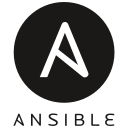

<h2>
Ian van der Linde: PostgreSQL 🐘 • Linux 🐧 • Python 🐍
</h2>

[Ian's notes](https://ivdl.co.za/) 💻 • [Bluesky](https://bsky.app/profile/ivdl.co.za) 🦋 • [LinkedIn](https://www.linkedin.com/in/ivdl/) 🧳 • [ORCiD](https://orcid.org/0000-0001-9232-9599) 📝 • [Shutterstock](https://www.shutterstock.com/g/Ian+van+der+Linde) 📸 • ian@ivdl.co.za 📧 

> [!NOTE]
> I am currently based in the beautiful city of Utrecht, in the Netherlands 🇳🇱. If you'd like to get in touch, send me an email at ian@ivdl.co.za, or connect/follow/message me on [LinkedIn](https://www.linkedin.com/in/ivdl/) 🙂

### About me

Hi, I’m Ian van der Linde (hence @Ianvdl and [ivdl.co.za](https://ivdl.co.za)). I am a Senior Mission Critical Engineer and Technical Lead at Conclusion Mission Critical in Utrecht, specialising in PostgreSQL and EnterpriseDB services. My work focuses on query performance optimisation, advanced database monitoring, and infrastructure automation using tools such as Puppet and Ansible, all in support of mission critical systems that demand continuous operation.

My career began in academic computing at the University of the Free State, where I worked as a high-performance computing engineer responsible for deploying and maintaining clustered research infrastructure. At Stellenbosch University, I expanded my expertise through designing and managing large PostgreSQL systems for bibliometric and scientometric research. This included integrating large datasets such as PATSTAT and Wikidata, implementing monitoring frameworks with Telegraf, Prometheus, and Grafana, and guiding the database team’s transition to agile project methodologies.

I later translated this research-driven expertise into enterprise IT. After founding Descry Technologies, I took on senior PostgreSQL roles at FairPlay Engineering and eventually at Conclusion Mission Critical, where I am currently responsible for uptime, resilience, and scalability in production environments. My M.Sc. research in sentiment analysis, along with publications in analytics and patent informatics, complements my technical practice with a grounding in data science and empirical decision-making. Today, I integrate research-grade systems design with the operational demands of enterprise environments, ensuring both performance and reliability at scale.

### Read some of my work

#### PostgreSQL

[Pretending to be PostgreSQL: Part one - the server handshake](https://ivdl.co.za/2024/03/02/pretending-to-be-postgresql-part-one-1/)

[Pretending to be PostgreSQL: Part two – responding to queries](https://ivdl.co.za/2024/11/24/pretending-to-be-postgresql-part-two-responding-to-queries/)

[The infinitely patient vacuum – a case study of what happens when the PostgreSQL VACUUM never completes](https://ivdl.co.za/2024/03/27/the-infinitely-patient-vacuum-a-case-study-of-what-happens-when-the-postgresql-vacuum-never-completes/)

[A room with a view of the PostgreSQL autovacuum](https://ivdl.co.za/2024/05/09/a-room-with-a-view-of-the-postgresql-autovacuum/)

[Estimating the disk space needed for a VACUUM FULL on PostgreSQL](https://ivdl.co.za/2024/05/13/estimating-the-disk-space-needed-for-a-vacuum-full-on-postgresql/)

[Achieving a 100x speedup of DELETEs on PostgreSQL](https://ivdl.co.za/2024/05/29/achieving-a-100x-speedup-of-deletes-on-postgresql/)

[PostgreSQL streaming replication characteristics on UNLOGGED tables](https://ivdl.co.za/2024/11/04/what-happens-if-you-enable-logging-on-an-unlogged-postgresql-table-with-streaming-replication/)

[A quickstart guide to CloudNativePG on Ubuntu and Mac OS](https://ivdl.co.za/2024/11/21/a-quickstart-guide-to-cloudnativepg-on-ubuntu-and-mac-os/)

#### Data science

[What do Norway and Namibia have in common?
](https://ivdl.co.za/2024/02/12/what-do-norway-and-namibia-have-in-common/)

#### Web development

[Demystifying HTTP with Telnet](https://ivdl.co.za/2024/02/19/demystifying-http-with-telnet/)

[Using the Django _meta API to write generalisable code within the confines of the ORM](https://ivdl.co.za/2023/07/07/using-the-django-_meta-api-to-write-generalisable-code-within-the-confines-of-the-orm/)

[Finding the database for a Django model class and instance](https://ivdl.co.za/2023/08/17/finding-the-database-for-a-django-model-class-and-instance/)

[Extending Django templating to create dynamic, nested templates](https://ivdl.co.za/2023/07/08/extending-django-templating-to-create-dynamic-nested-templates/)

[Constructing an automated workflow based on the Django manage.py inspectdb command](https://ivdl.co.za/2023/07/07/constructing-an-automated-workflow-based-on-the-django-manage-py-inspectdb-command/)

#### Mac OS

[Essential, open source Mac apps](https://ivdl.co.za/2024/06/17/essential-mac-apps/)

[Fixing “Waiting to upload” for iCloud in Mac OS Finder](https://ivdl.co.za/2023/08/24/fixing-waiting-to-upload-for-icloud-in-mac-os-finder/)

[How to add an iCloud shortcut to your Mac home folder](https://ivdl.co.za/2023/07/24/how-to-add-an-icloud-shortcut-to-your-mac-home-folder/)

#### Windows

[A look back at some older 16-bit shareware games for Windows](https://ivdl.co.za/2021/10/14/a-look-back-at-some-older-16-bit-shareware-games-for-windows/)

### Other experience and tooling

    
    
    
    
    
    
    
    
    
    
    
    
    
    
    
    
    
    
    
    
    
    
    
    
    
    
    
    
    
    
    
    
    
    
    
    
    
    

